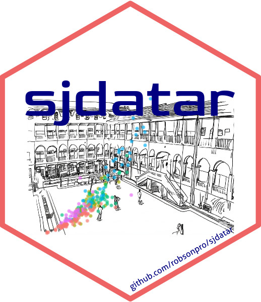

## R package sjdatar

[

The package sjdatar contains data collected by the students of Supervised Learning course taught at Federal University of São João del-Rei (UFSJ) in the Industrial Engineering undergraduate.

Access the vignette for more information.

https://robsonpro.github.io/sjdatar/Vignette_sjdatar

## License

This project is licensed under MIT license - see LICENSE for more details.

[
